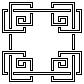
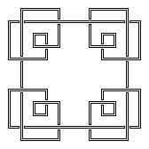
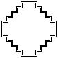
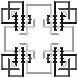
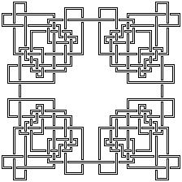

# Knotty
Generates Celtic-esque knots using a custom encoding technique to ensure no colinear lines.  Pseudo-randomness added using LFSR to allow deterministic but random looking generation.  Converts final encoding into an image.

## Parameters
The size parameter determines the number of parallel lines in each quadrant.  This is saved as "s" in the output file's name.

Eg: Knot11111111_s5_m1.jpg

The spacing parameter (which scales the output by multiplying the scale of the grid) allows adjusting how dense the lines will be drawn.  This is saved as "m" in the output file's name.

Eg: Knot11111111_s5_m2.jpg

The seed parameter determines the actual shape of the knot by determining the pseudo-random shuffling of the encoding of the knot.

Eg: Knot777777777777777711_s5_m1.jpg

## Additional Example Knots

